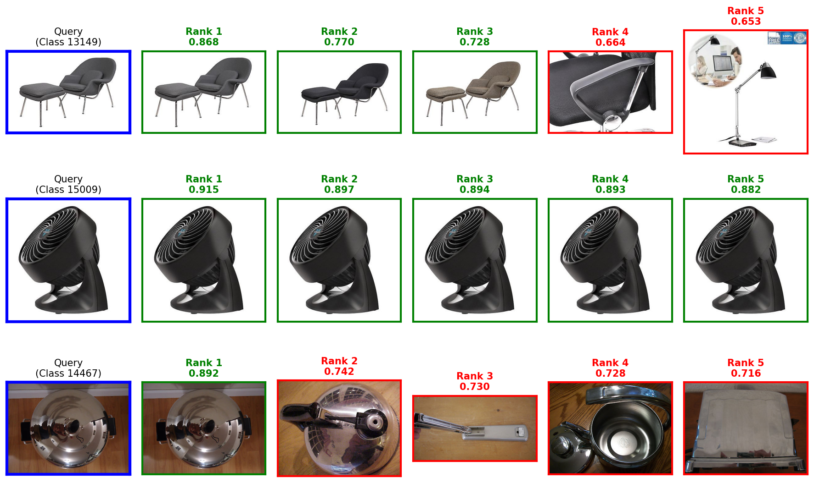
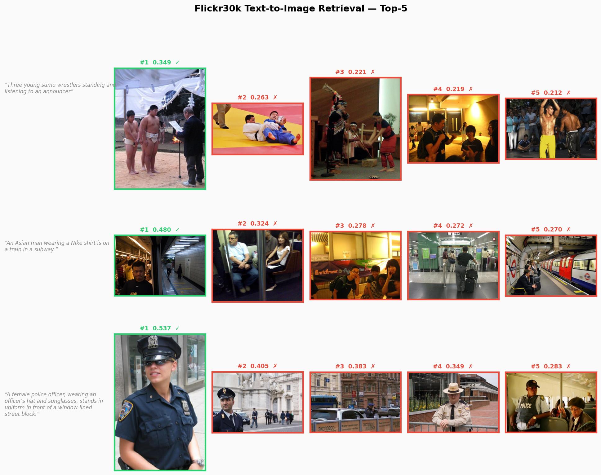

# vembed-factory

<p align="center">
  <strong>视觉与多模态 Embedding 训练工厂</strong>
</p>

<p align="center">
  <em>微调 CLIP, SigLIP, Qwen-VL 等模型 — 赋能视觉 RAG 与多模态搜索。</em>
</p>

<p align="center">
  <a href="https://github.com/fangzhensheng/vembed-factory/actions/workflows/ci.yml"></a>
  <a href="https://opensource.org/licenses/MIT"></a>
  <a href="https://colab.research.google.com/github/fangzhensheng/vembed-factory/blob/main/notebooks/vembed-factory_colab.ipynb"></a>
</p>

---

## 为什么选择 vembed-factory?

市面上已有许多优秀的 Embedding 库，**vembed-factory** 的定位如下：

| 特性 | vembed-factory | sentence-transformers | FlagEmbedding |
| :--- | :---: | :---: | :---: |
| **CLIP / SigLIP 微调** | ✅ | 部分 | ❌ |
| **Qwen-VL / VLM Embedding** | ✅ | ❌ | ❌ |
| **梯度缓存 (显存优化)** | ✅ | ❌ | ✅ |
| **Matryoshka (MRL)** | ✅ | ✅ | ❌ |
| **延迟交互 (ColPali)** | ✅ | ❌ | ❌ |
| **组合编码器 (BERT + DINOv2)** | ✅ | ❌ | ❌ |
| **知识蒸馏** | ✅ | ✅ | ✅ |
| **LoRA 微调** | ✅ | ❌ | ❌ |
| **W&B / TensorBoard 日志** | ✅ | ✅ | ❌ |
| **专注于训练 (无部署绑定)** | ✅ | ❌ | ❌ |

**核心理念**: *"Do one thing and do it well."* 我们专注于 **训练** 和 **评测**，并输出标准的 HuggingFace 权重，您可以将其部署到任何地方 — LangChain, Milvus, Vespa 或任何向量数据库。

## 核心功能

- **纯粹的工厂模式**: 数据输入 -> 微调后的 Embedding 模型 + 评测报告输出。
- **广泛的模型支持**:
  - **双塔编码器 (Dual-Encoders)**: CLIP, SigLIP, EVA-CLIP
  - **视觉语言模型 (VLMs)**: Qwen3-VL-Embedding (2B/8B)
  - **延迟交互 (Late Interaction)**: ColPali, ColQwen (多向量细粒度检索)
  - **组合编码器**: 混合任意文本编码器 + 图像编码器 (如 BERT + DINOv2)
- **高效训练**:
  - **梯度缓存 (Gradient Cache)**: 在 16G/24G 显存 GPU 上实现 BS=512+ 的大批次训练
  - **Matryoshka (MRL)**: 一次训练 -> 任意维度 Embedding (768, 512, 256, 128)
  - **LR 调度**: 余弦退火, 线性, 常数 (带预热)
  - **LoRA**: 参数高效微调
- **通用数据引擎**: 支持 JSONL, CSV, Parquet, HuggingFace Datasets，支持灵活的列映射
- **实验追踪**: 内置 W&B 和 TensorBoard 集成

## 支持模型

| 模型类型 | 示例 | 适用场景 |
| :--- | :--- | :--- |
| **视觉语言模型** | **Qwen3-VL-Embedding-2B/8B** | SOTA 多模态检索 |
| **双塔编码器** | OpenAI CLIP, SigLIP, EVA-CLIP | 通用场景, 零样本检索 |
| **延迟交互** | **ColPali**, ColQwen | 细粒度文档检索 |
| **组合模型** | BERT + DINOv2, BGE + BGE | 垂直领域, 文本检索 |

## 快速开始

### 安装

**选项 1: uv (推荐)**

```bash
# 如果尚未安装 uv
curl -LsSf https://astral.sh/uv/install.sh | sh

# 克隆并同步 (自动创建 .venv 并从 lockfile 安装所有依赖)
git clone https://github.com/fangzhensheng/vembed-factory.git
cd vembed-factory
uv sync
source .venv/bin/activate

python run.py examples/clip_train.yaml
```

**选项 2: pip**

```bash
pip install vembed-factory

# 或从源码安装
git clone https://github.com/fangzhensheng/vembed-factory.git
cd vembed-factory
pip install -e ".[all]"
```

**选项 3: Docker**

```bash
# 使用 docker compose (推荐)
git clone https://github.com/fangzhensheng/vembed-factory.git
cd vembed-factory
docker compose up -d
docker compose exec vembed bash

# 或手动构建运行
docker build -t vembed-factory .
docker run --gpus all -it -v $(pwd)/data:/app/data vembed-factory bash
```

### 三行代码训练 (Python API)

```python
from vembed import Trainer

trainer = Trainer("openai/clip-vit-base-patch32")
trainer.train(data_path="data/train.jsonl", output_dir="output", epochs=3)
```

### 推理 (Inference)

```python
from vembed import Predictor

predictor = Predictor(model_path="output/checkpoint-epoch-3")

text_emb = predictor.encode_text("a photo of a cat")
image_emb = predictor.encode_image("cat.jpg")
```

### 命令行界面 (CLI)

```bash
# 使用 YAML 配置训练 (推荐)
python run.py examples/qwen3_2b_train.yaml

# 使用 MRL 训练 CLIP
python run.py examples/clip_train.yaml

# 训练 ColPali (延迟交互)
python run.py examples/qwen_colbert.yaml
```

## 数据格式

vembed-factory 支持灵活的输入数据。JSONL 文件中的每一行都是一个训练样本：

| 模式 | 示例 |
| :--- | :--- |
| **文搜图 (T2I)** | `{"query": "a cat", "positive": "images/cat.jpg", "negatives": ["images/dog.jpg"]}` |
| **图搜图 (I2I)** | `{"query_image": "shoe_query.jpg", "positive": "shoe_target.jpg"}` |
| **图搜文 (I2T)** | `{"query_image": "cat.jpg", "positive": "a cute cat on a sofa"}` |
| **多模态检索 (M2I/CIR)** | `{"query_image": "shirt_blue.jpg", "query": "change to red", "positive": "shirt_red.jpg"}` |
| **文搜文 (T2T)** | `{"query": "capital of france", "positive": "Paris is the capital of France"}` |

## 配置

训练主要通过 YAML 文件配置。优先级顺序如下：
`Defaults` < `YAML 配置` < `CLI 覆盖`。

```bash
# 使用指定的配置文件运行
python run.py examples/clip_train.yaml

# 通过 CLI 覆盖特定设置
python run.py examples/clip_train.yaml --config_override batch_size=64 learning_rate=1e-5
```

关键配置选项 (可在 YAML 或 CLI 中设置)：

| 参数 | 默认值 | 描述 |
| :--- | :--- | :--- |
| `scheduler_type` | `cosine` | LR 调度器: `cosine`, `linear`, `constant`, `constant_with_warmup` |
| `warmup_ratio` | `0.1` | 预热步数比例 |
| `weight_decay` | `0.01` | AdamW 权重衰减 |
| `max_grad_norm` | `1.0` | 梯度裁剪 (0 表示禁用) |
| `report_to` | `none` | 实验追踪: `wandb`, `tensorboard`, `all`, `none` |
| `logging_steps` | `10` | 每 N 步记录一次指标 |
| `use_gradient_cache` | `true` | 内存高效的大批次训练 |
| `use_mrl` | `false` | Matryoshka 表征学习 |
| `use_lora` | `false` | LoRA 微调 |

完整列表请参考 [`configs/defaults.yaml`](configs/defaults.yaml)。

## 学习资源

### 分步指南

- **[DINOv2 图像检索](docs/guides/dinov2_finetune.md)** - 在 SOP 数据集上微调 DINOv2 实现高精度图像搜索
- **[Jupyter Notebooks](notebooks/)** - 交互式教程覆盖各种使用场景
- **[API 文档](docs/api/)** - 所有模块的详细 API 参考

## 开发与贡献

有兴趣贡献？请查看 [CONTRIBUTING.md](CONTRIBUTING.md) 了解开发环境设置和指南。

## 评测结果

### Stanford Online Products (SOP) - 图搜图 (I2I)

我们使用 `vembed-factory` 在 SOP 数据集 (电商商品) 上微调了 **DINOv2-base** 和 **MAE-base** 模型。

**定性结果 (Top-5 检索):**


| 模型 | 指标 | 零样本 (Zero-shot) | 微调后 (Fine-tuned) | 提升 (Delta) |
| :--- | :--- | :--- | :--- | :--- |
| **DINOv3-ViT-B/16** | Recall@1 | 65.32% | **83.13%** | +17.81 |
| *(facebook/dinov3-vitb16-pretrain-lvd1689m)* | Recall@10 | 80.73% | **93.34%** | +12.61 |
| | Recall@100 | 90.43% | **97.26%** | +6.83 |
| **MAE-base** | Recall@1 | 52.06% | **72.70%** | +20.64 |
| *(facebook/vit-mae-base)* | Recall@10 | 68.96% | **86.80%** | +17.83 |
| | Recall@100 | 82.24% | **94.21%** | +11.97 |

**训练配置:**
- **任务**: 图搜图 (I2I)
- **损失函数**: 对比学习 (InfoNCE)
- **Epochs**: 20 (DINOv3), 50 (MAE)

### Flickr30k - 图文检索 (T2I / I2T)

我们使用 `vembed-factory` 在 Flickr30k (Karpathy split) 上微调了 **CLIP ViT-B/32** 和 **Qwen3-VL-Embedding-2B**。

**可视化结果 (Top-5 检索):**


#### 文搜图 (Text → Image)

| 模型 | 指标 | 训练前 (Zero-shot) | 训练后 (Fine-tuned) | 提升 (pp) |
| :--- | :--- | :--- | :--- | :--- |
| **CLIP ViT-B/32** | Recall@1 | 58.12% | **70.54%** | +12.42 |
| *(openai/clip-vit-base-patch32)* | Recall@5 | 83.18% | **91.82%** | +8.64 |
| | Recall@10 | 89.46% | **95.80%** | +6.34 |
| | MRR | 69.23% | **79.79%** | +10.56 |
| **Qwen3-VL-2B** | Recall@1 | 83.26% | **85.84%** | +2.58 |
| *(Qwen/Qwen3-VL-Embedding-2B)* | Recall@5 | 96.04% | **97.38%** | +1.34 |
| | Recall@10 | 98.04% | **98.78%** | +0.74 |
| | MRR | 89.02% | **91.02%** | +2.00 |

#### 图搜文 (Image → Text)

| 模型 | 指标 | 训练前 (Zero-shot) | 训练后 (Fine-tuned) | 提升 (pp) |
| :--- | :--- | :--- | :--- | :--- |
| **CLIP ViT-B/32** | Recall@1 | 78.60% | **80.70%** | +2.10 |
| *(openai/clip-vit-base-patch32)* | Recall@5 | 95.40% | **96.00%** | +0.60 |
| | Recall@10 | 98.40% | **98.80%** | +0.40 |
| | MRR | 85.80% | **87.25%** | +1.45 |
| **Qwen3-VL-2B** | Recall@1 | 94.10% | **94.70%** | +0.60 |
| *(Qwen/Qwen3-VL-Embedding-2B)* | Recall@5 | 99.60% | **99.80%** | +0.20 |
| | Recall@10 | 100.00% | **100.00%** | +0.00 |
| | MRR | 96.48% | **96.87%** | +0.39 |

**Rsum 比较 (Recall Sum)**:
- CLIP ViT-B/32: 503.16 → **533.66** (+30.50)
- Qwen3-VL-2B: 571.04 → **576.50** (+5.46)

### Matryoshka 表征学习 (MRL)

我们对 **Qwen3-VL-Embedding-2B** 进行了 MRL 微调，使模型能够生成可变维度的高质量 Embedding (从 1536 到 256)。

**Flickr30k 文搜图 (T2I) 结果:**

| 维度 | 指标 | 训练前 (Zero-shot) | 训练后 (Fine-tuned MRL) | 提升 (pp) |
| :--- | :--- | :--- | :--- | :--- |
| **1536 (Full)** | Recall@1 | 83.24% | **84.98%** | +1.74 |
| | Recall@5 | 96.12% | **96.66%** | +0.54 |
| **1024** | Recall@1 | 82.74% | **84.68%** | +1.94 |
| **768** | Recall@1 | 82.18% | **84.42%** | +2.24 |
| **512** | Recall@1 | 81.80% | **84.50%** | +2.70 |
| **256** | Recall@1 | 80.18% | **83.20%** | +3.02 |

**核心洞察:**
- **6倍压缩**: 在 256 维度下，MRL 微调模型的 Recall@1 达到 **83.20%**，与原始 1536 维模型的性能 (83.24%) 相当。
- **自适应**: 单个模型支持所有这些维度。您可以存储 256 维向量用于快速搜索，并使用 1536 维向量进行高精度重排序。

**训练配置:**
- **任务**: 图文检索 (T2I + I2T)
- **损失函数**: 对比学习 (InfoNCE)
- **模型**: Qwen3-VL-Embedding-2B


## 许可证 & 引用

MIT License. 基于 [GradCache](https://github.com/luyug/GradCache)、[HuggingFace Transformers](https://github.com/huggingface/transformers) 和 [Accelerate](https://github.com/huggingface/accelerate) 构建。

如果您在研究中使用了 vembed-factory，请引用：
```bibtex
@misc{vembed-factory,
  author = {Fang Zhensheng},
  title = {vembed-factory: A Factory for Visual & Multimodal Embeddings},
  year = {2025},
  publisher = {GitHub},
  howpublished = {\url{https://github.com/fangzhensheng/vembed-factory}}
}
```
